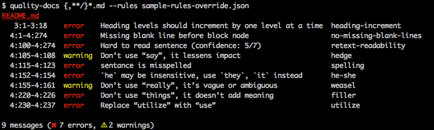

# `quality-docs`



> A CLI tool to check the quality of writing in your project's markdown or plain text documentation.

This tool uses [`retext`](https://github.com/wooorm/retext) to check the quality of writing in your project's documentation using these plugins;

- [`retext-equality`](https://github.com/wooorm/retext-equality) warns on insensitive, inconsiderate language.
- [`retext-intensify`](https://github.com/wooorm/retext-intensify) warns on filler, weasel and hedge words.
- [`remark-lint`](https://github.com/wooorm/remark-lint) checks for proper markdown formatting.
- [`retext-readability`](https://github.com/wooorm/retext-readability) checks the reading level of the whole document.
- [`retext-simplify`](https://github.com/wooorm/retext-simplify) warns on complicated phrases.
- [`retext-spell`](https://github.com/wooorm/retext-spell) checks spelling against a US English dictionary and [custom dictionary](#custom-dictionary).

## Table of Contents

- [Installation](#installation)
- [Usage](#usage)
  - [Options](#options)
  - [Reports](#reports)
  - [Custom Dictionary](#custom-dictionary)
  - [Changing Default Config](#changing-default-config)
- [Troubleshooting](#troubleshooting)
- [Contribute](#contribute)
- [License](#license)

## Installation

Install the tool globally with [npm](https://npmjs.com/) to use the CLI.

```bash
npm install -g quality-docs
```

## Usage

### CLI

The CLI accepts one argument which is a glob of the documentation files you want to check. For example, to recursively check every `.md` file in your project;

```bash
quality-docs {,**/}*.md
```

#### Silent Mode

The `-s`, `--silent` flag enables silent mode which mutes warnings. Fatal errors are displayed in silent mode.

#### Config

The `-c`, `--config` flag passes in a JSON file with a custom config. The config is combined with `default-config.json` and the custom config overrides the defaults.

```bash
quality-docs {,**/}*.md --config custom-config.json
```

The override uses this format (without comments):

```js

{
  "dictionaries": "sparkart.dic", // Path to custom dictionary file, relative to config file
  "rules": { // Turn rules on/off or change their severity
    "filler": {"severity": "warn"},
    "hedge": {"severity": "suggest"},
    "list-item-content-indent": false,
    "no-auto-link-without-protocol": false,
    "retext-readability": {
      "age": 18,
      "minWords": 7,
      "severity": "fatal"
    },
    "weasel": {"severity": "suggest"}
  },
  "ignore": [ // Words or phrases to ignore
    "can",
    "forward",
    "found",
    "start",
    "started",
    "up"
  ],
  "noIgnore": [ // Words or phrases ignored by default to not ignore
    "require",
    "transmit"
  ]
}
```

#### Ignore

When used along with the config flag, the `-i`, `--ignore` flag adds a word to the config file's ignore list. Example;

```bash
$ quality-docs {,**/}*.md --config custom-config.json --ignore irregardless
Added 'irregardless' to ignore list. Don't forget to commit the changes to custom-config.json.
```

### Reports

The tool uses [`vfile-reporter`](https://github.com/wooorm/vfile-reporter) to print a report of writing quality issues with their location and description. For example, a spelling error in `README.md` from line 76 column 119 to line 76 column 124 prints;

```bash
README.md
  76:119-76:124  error    thier is misspelled         spelling
```

### Custom Dictionary

By default, `quality-docs` spell checks documents against [a US English dictionary](https://github.com/wooorm/dictionaries/dictionaries/en_US). To extend the built in dictionary with custom English terms related to your project(s), add a [hunspell format](http://linux.die.net/man/4/hunspell) `.dic` file to your project, and reference it with the `customDictionary` key in a custom config JSON file. See [`en_US-tech-industry.dic`](./en_US-tech-industry.dic) for an example. (Note: `quality-docs` uses the [US English affix file](https://github.com/wooorm/dictionaries/blob/master/dictionaries/en_US/index.aff) to check for valid variants of dictionary words. Non-English characters or prefix/suffix rules are not supported.)

### Changing Default Config

The `quality-docs` CLI ships with an opinionated configuration to improve your writing. If you want to override the defaults of [the `retext` plugins used by this tool](#quality-docs), we recommend one of these three options;

1. [Exclude documentation files from the glob argument](http://tldp.org/LDP/GNU-Linux-Tools-Summary/html/x11655.htm#STANDARD-WILDCARDS).
2. Use [the `--config` flag](#config) to pass in a JSON file with default configuration overrides.
3. Use [`remark-message-control` marks](https://github.com/wooorm/remark-message-control) to turn on/off specific rules for individual documents or text nodes.

## Troubleshooting

Here is a list of common confusing issues `quality-docs` flags, and how to resolve them;

### Names are flagged as misspelled

  If it's a common name, add it to a [custom dictionary](#custom-dictionary). If it isn't common or you don't want to add it to the dictionary, [add it to the `ignore` array in a config override file](#config).

### Other non-dictionary terms are flagged as misspelled

  Any non-dictionary terms in quotes are ignored. If the word is a literal value such as a variable name or package name, put it in backticks; `` `quality-docs` ``. If it's a made-up word or other literal representation of a non-dictionary term, use `"buttonator"` or `'buttonator'`.

### Table cells are flagged as being incorrectly padded

  First, check [the rules for formatting table cells in markdown](https://github.com/wooorm/remark-lint/blob/master/doc/rules.md#table-cell-padding). If everything is correct, check for empty table cells, which throw off the linter. Try adding content to blank cells; `n/a` or `(none)`.

### Another issue is being incorrectly flagged

  Try using [the methods provided to change the default config](#changing-default-config) to suit your preferences. If custom config doesn't resolve the problem, [file an issue](https://github.com/SparkartGroupInc/quality-docs/issues) including the text of the markdown file you're checking and the error you're seeing in the output.

## Contribute

[Open an issue](https://github.com/sparkartgroupinc/quality-docs/issues/new) to report bugs or ask questions. [Open a PR](https://github.com/sparkartgroupinc/quality-docs/pulls) to contribute. Run `npm run test` to make sure contributions pass the included tests.

## License

[MIT &copy; 2016 Sparkart Group Inc.](./LICENSE)
